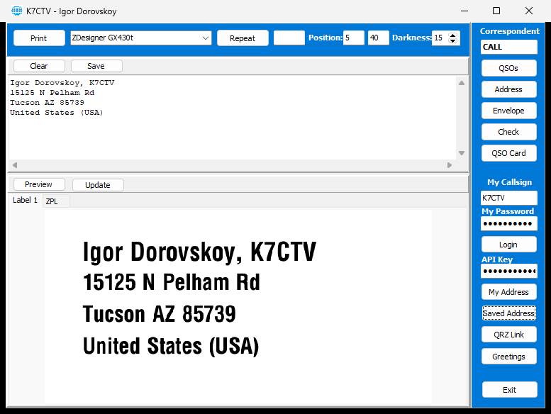
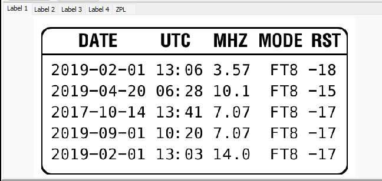
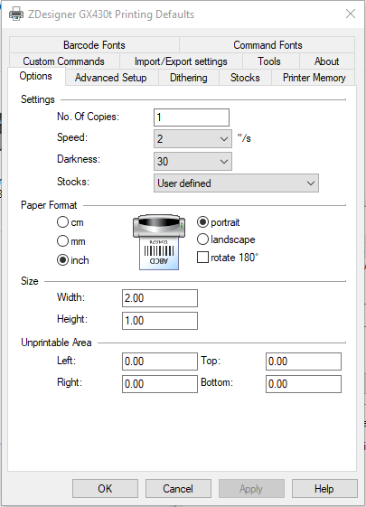
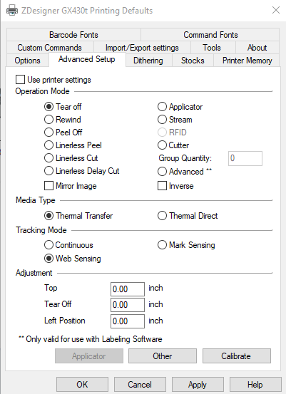

# QRZ Label — Downloads

**QRZ Label** is a free Windows app for amateur-radio operators that prints **QSL labels**
on **Zebra (ZPL) label printers**. It looks up callsign and address data from **QRZ.com**,
can pull your **QSO log** from the QRZ Logbook, and turns it into ready-to-print labels —
address, envelope, greeting, QR-code ("QRZ Link"), and multi-QSO confirmation cards — with
an on-screen tabbed **preview**.

> This repository hosts the **ready-to-run installer only**. The source code is not included.
> © K7CTV — Igor Dorovskoy.



*Tabbed preview — a multi-QSO confirmation card rendered across several **Label** tabs
plus the **ZPL** code tab:*



---

## Download & install

1. Open the [**latest release**](../../releases/latest) and download
   **`QRZLabel_x.x.x.x.exe`**.
2. Run it and follow the installer prompts.

### "Unknown publisher" / SmartScreen warning

The app and installer are **code-signed** with a self-signed certificate
(`CN=K7CTV Software`), so Windows may show *"Windows protected your PC"* or
*"Unknown publisher."* That's expected for an independently published app.

- **To run anyway:** click **More info → Run anyway**.
- **To make Windows show "Verified publisher: K7CTV Software"**, import the included
  **`K7CTV-CodeSigning.cer`** into your **Trusted Root Certification Authorities** *and*
  **Trusted Publishers** stores. Per-user (no admin), in PowerShell:

  ```powershell
  Import-Certificate -FilePath K7CTV-CodeSigning.cer -CertStoreLocation Cert:\CurrentUser\Root
  Import-Certificate -FilePath K7CTV-CodeSigning.cer -CertStoreLocation Cert:\CurrentUser\TrustedPublisher
  ```

  Only do this if you trust the publisher — it makes your PC trust anything signed by this key.

Certificate thumbprint: `F109EBB27DAA43A63C86C54A1DDEFFD24B549F21`.

---

## Requirements

- **Windows** (the app is a native Win32 program; runs on 32- and 64-bit Windows).
- A **Zebra-compatible ZPL label printer** (e.g. Zebra GX430t) installed as a Windows printer.
  Labels are designed for the **2 × 1 inch** label size.
- A **QRZ.com account**:
  - Callsign + password — to look up callsign/address data via the QRZ **XML** interface
    (full address data generally needs an active QRZ **XML Logbook Data** subscription).
  - A QRZ **Logbook API key** — *optional*. The **QSOs** feature works without it: with the
    API Key field left empty, the app signs in to the QRZ.com **website** to pull your log
    (requires two-factor login to be **off**). Set a key to use the QRZ Logbook **API** instead.
- **Internet access** for QRZ lookups and the on-screen label preview (rendered by the
  online Labelary service). The required OpenSSL DLLs are included by the installer.

---

## First run

1. Start the app, then in the right-hand panel enter **My Callsign**, **My Password**, and
   (optional) **API Key**, pick your **Printer**, and click **Login**.
2. Settings save automatically per Windows user under `%APPDATA%\QRZ Label\`. Your
   **password** and **API key** are encrypted at rest with the Windows Data Protection API
   (DPAPI) — they're readable only by your Windows account.
3. Type a correspondent's callsign, generate a label, check the **preview tabs**, then
   **Print**.

> Each user needs their **own** QRZ.com account and API key — no credentials are shared in
> this app.

---

## Example: confirm a QSO

1. Start the app — it auto-logs in with your saved settings.
2. Type the other station's call in **Correspondent** and press **Enter** (or click **QSOs**).
   The app pulls your QSO log for that station from the QRZ Logbook — via the API if you set
   an **API Key**, otherwise by signing in to the QRZ.com website — and builds a **QSO
   confirmation card**.
3. Review the rendered label in the **Label** preview tabs (the **ZPL** tab shows the code).
4. Tweak **Position**/**Darkness** if needed, or edit the source text and click **Update** to
   regenerate.
5. Click **Print** — or set a copy **count** and click **Repeat** for several copies.

*Need an address label instead?* Type the call in **Correspondent**, click **Address** (or
**Envelope**), then **Print**.

---

## Printer setup (Zebra GX430t)

Reference configuration for a Zebra GX430t — match these settings for correct label
sizing and darkness. The labels are designed for the **2 × 1 inch** size:




---

## License

Freeware, provided **as-is**, without warranty of any kind. You may use and redistribute the
installer unchanged. The source code is not included and is not licensed for redistribution.

73 de **K7CTV**
